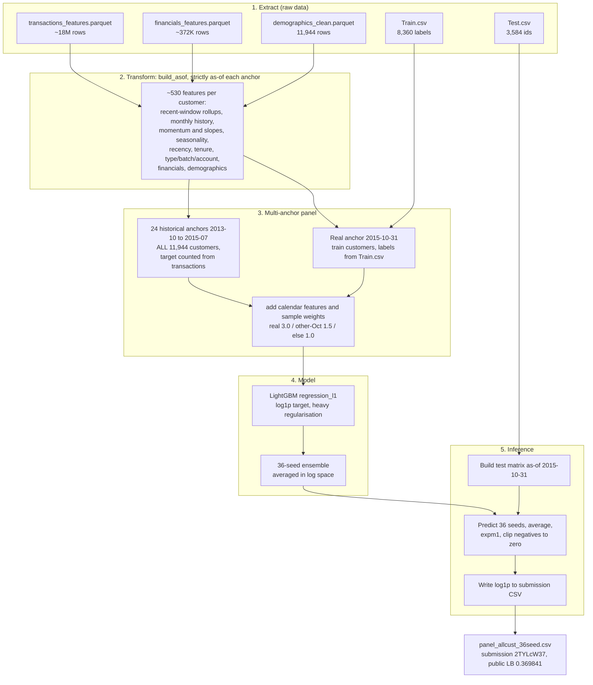

# Solution write-up - Nedbank Transaction Volume Forecasting (#4)

**Private leaderboard: #4.** Public LB **0.369841** (`panel_allcust_36seed.csv`, Zindi submission
id `2TYLcW37`). Metric: RMSLE.

This is the full write-up behind [`solution.ipynb`](solution.ipynb), which runs end-to-end and
reproduces the exact submission. It doubles as the code-review documentation, so it covers the
approach *and* the practical details (architecture, data pipeline, runtime, error handling,
reproducibility, and how to maintain/retrain it).

## 1. Overview

For each customer, predict the number of banking transactions they will make in the 3 months
Nov 2015 - Jan 2016, given ~18M historical transactions (Dec 2012 - Oct 2015) plus monthly financial
snapshots and demographics. RMSLE grades error on a log scale, so getting the quiet and medium
customers right matters far more than the rare very-busy ones.

The whole solution is a response to one fact: the **training customers and the test customers are
different people** (disjoint), so ordinary cross-validation misleads you - in practice, better CV
kept producing worse leaderboard scores. The fix is a **multi-anchor panel** that turns ~8k rows
into ~250k and forces the model to learn a general "recent behaviour -> next quarter" rule instead
of memorising specific customers, trained with one heavily-regularised LightGBM and averaged over 36
seeds. No GPU, no deep learning, no multi-model blend.

## 2. What makes it hard: disjoint customers

The 8,360 training customers (with labels) and the 3,584 test customers (to predict) do not overlap.
So holding out training customers to validate yourself measures how well you predict *people like
the ones you already saw*, not *unseen strangers* - and strangers are what the leaderboard grades.
For most of the competition, better cross-validation gave a worse public score. Every decision below
follows from that.

## 3. A scoring quirk worth knowing

The live platform scores plain RMSE against a reference stored as `log1p(true_count)`. In effect it
takes the log of the true answers before comparing, so you must submit `log1p(prediction)`, not raw
counts. We verified this early: raw counts scored ~199 (nonsense); the identical predictions as
`log1p` scored ~0.38. The `write_submission` helper applies `log1p` and validates the file format.

## 4. The idea that worked: a multi-anchor panel

The obvious setup is one row per customer as of 31 Oct 2015 - 8,360 rows. With a single snapshot the
model can quietly memorise those specific people, which does not transfer to disjoint strangers.

A **multi-anchor panel** fixes this. It is a standard rolling-origin technique for time series: pick
many historical "anchor" dates, describe each customer using only what was known by that date, and
set the target to their realized next-3-month count (which you can simply count, because that window
is already in the past). One customer becomes many (customer, anchor) rows across seasons and
activity levels, so the model learns the general rule instead of customer identity.

Our winning panel:

- **Real anchor 2015-10-31** (scored month): rows are the 8,360 train customers, labels from
  `Train.csv`. Test customers are excluded here (their future is the hidden target).
- **24 historical anchors** (month-ends 2013-10-31 to 2015-07-31): rows are **all 11,944 customers**
  (train and test), targets counted from observed transactions. This is not leakage - the whole
  3-month window at a historical anchor lies in the past relative to the Oct 2015 data cutoff - and
  it lets the model see the test customers' own historical behaviour, directly attacking the
  disjoint-customer problem.
- **Calendar features per anchor** (anchor month/year; whether the next 3 months include
  Nov/Dec/Jan; number of days/weekends) so seasonality is preserved across the stacked months.
- **Sample weights**: real 2015-10 anchor 3.0, other Octobers 1.5, everything else 1.0.

Result: ~253k rows x ~530 features, versus the 8,360-row snapshot we started from.

## 5. Architecture

## 6. Data and the ETL pipeline

All ETL is in code (`solution.ipynb`), reproducibly, with no manual/Excel preprocessing.

**Extract.** Three parquet sources plus two CSVs: `transactions_features.parquet` (18,017,073 rows,
Dec 2012 - Oct 2015), `financials_features.parquet` (~372K monthly interest-income snapshots),
`demographics_clean.parquet` (11,944 profiles), `Train.csv` (labels), `Test.csv` (ids). The large
transaction table is read column-pruned (only the 8 columns used) and downcast on load (`float32`,
low-cardinality strings to `category`), which keeps it around ~2 GB instead of ballooning.

**Transform.** For a cutoff date, `build_asof(cutoff, ids)` computes ~530 features using **only**
data on or before that cutoff (strict as-of discipline, so the same code is leakage-safe at every
historical anchor). Families: recent-window rollups (7/14/30/60/90/180 days), monthly history with
momentum/slopes/YoY, seasonal/festive aggregates, recency and inter-transaction gaps, tenure
(months-on-book with explicit zeros for new customers), transaction-type/batch/account mix,
financials and demographics. Missing values are filled with the column median then 0 - a domain
choice: for count/share features a missing month genuinely means "zero activity", and encoding it as
0 beat passing NaN to the model on the leaderboard (Section 11).

**Load.** Matrices are held in memory as `float32`. The only persisted outputs are submission CSVs
(predictions stored as `log1p(count)`).

## 7. The model and the core finding

One **LightGBM** regressor, **L1 objective**, trained on `log1p(target)` with sample weights, and
heavily regularised: `learning_rate=0.02`, `n_estimators=3000`, `num_leaves=63`,
`min_child_samples=40`, `subsample=0.7`, `colsample_bytree=0.5`, `reg_alpha=2`, `reg_lambda=10`.
Every knob fights memorisation, because of the finding that ran through all our experiments:

> **Adding same-distribution data helps the leaderboard; adding model capacity (extra features,
> heavier tuning, ensembles of correlated models) improves cross-validation but hurts the
> leaderboard.**

On a disjoint-customer problem, extra capacity just gives the model more room to memorise training
customers. So once the panel was in place, the only leaderboard-safe lever left was **variance
reduction**: train the identical model over many random seeds and average. It cannot overfit - only
cancel noise. It converged as expected: 3 seeds 0.37069, 24 seeds 0.369928, 36 seeds **0.369841**
(the variance floor). The winning file is that 36-seed average.

## 8. Validation

GroupKFold (5 folds) grouped by `UniqueID`, out-of-fold error measured only on the real-anchor
(2015-10) rows and scored as RMSLE on `expm1`. We used it as a diagnostic, not a blind selection
gate, because we independently confirmed that CV improvements from added capacity did not transfer
to the leaderboard (Section 11).

## 9. Inference

Batch prediction (no live serving): build the test matrix as-of 2015-10-31 for the 3,584 test
customers, reindex to the training column order, predict with each of the 36 seed models, average in
log space, `expm1` back to counts, clip negatives to zero (a validity floor, not leaderboard-tuning),
and write `log1p(prediction)` to the submission CSV. The exact winning artifact is
`submissions/panel_allcust_36seed.csv`; the model is fully specified by (panel definition + CHAMP
params + the 36-seed list), all in code.

## 10. Runtime and performance

**Environment:** Apple M5, 10-core CPU, 16 GB RAM, macOS, Python 3.12.13. **CPU only, no GPU.**

| Phase | Wall-clock |
| --- | --- |
| Feature engineering + panel build (25 anchors, 253,498 x 530) | 10.7 min |
| Test matrix build | ~0.7 min |
| Model training + inference (36 LightGBM fits) | ~96 min |
| **Total (data processing + modeling + inference)** | **~107 min (1 h 47 m)** |

| Metric | Value |
| --- | --- |
| Public leaderboard RMSLE (`2TYLcW37`) | 0.369841 |
| Private leaderboard rank | #4 |
| Real-anchor GroupKFold OOF RMSLE (single seed, diagnostic) | ~0.375 |

Note: the OOF looks worse than the leaderboard, and OOF *improvements* from added capacity failed to
transfer - which is exactly why the final choice was driven by robustness, not by chasing CV.

## 11. What we tried - worked and did not

We treated the leaderboard like a lab; each probe changed one thing against a clean baseline. The
most useful result is negative - once the panel was in place, almost nothing else helped.

**Worked (in the final solution):** the panel; including all customers at historical anchors; seed
averaging 3 -> 36; `log1p` submission; L1 objective; heavy regularisation.

**Did not work (CV said yes, leaderboard said no):**

| Change | Leaderboard |
| --- | --- |
| EWMA-decay recency features on the clean base | 0.373984 (worse) |
| Heavier tuning / regularisation sweep | 0.369992 at 3 seeds, but 0.370582 at 24 (seed luck) |
| Passing missing values as NaN instead of median/0 fill | 0.377782 (+0.007 worse) |
| Closing-balance "capacity to spend" features | 0.374-0.378 (worse) |
| Deeper tenure + raw-space averaging | 0.375698 (worse) |

**Deliberately not pursued:** blending several correlated boosted-tree models (once each was 0.9+
correlated, blending stopped helping), and a fitted saturation-growth-curve baseline plus residual
(a different modelling approach we judged out of scope for the final days).

**The transferable lesson:** on a disjoint-group transfer problem, trust the direction of the
leaderboard over local cross-validation, expand your *data* rather than your model's *capacity*, and
denoise with seeds before believing a small gain.

## 12. Error handling and logging

- **Submission-format guard.** `write_submission` asserts the exact column set, no NaN, non-negative
  predictions, row count equal to `SampleSubmission.csv`, matching id set, and no NaN after the
  order-preserving merge (catches any id misalignment). A malformed file fails loudly.
- **Leakage discipline.** `build_asof` filters transactions to `<= cutoff` before any aggregation;
  historical-anchor targets are only computed where the full 3-month window precedes the data
  boundary.
- **Progress logging.** Long builds print per-anchor and per-seed progress so a run can be monitored.
- **Memory safety** (16 GB machine): column-pruned/downcast loads bound the transaction table to
  ~2 GB, and `del model; gc.collect()` between sequential fits prevents the accumulation that
  otherwise runs out of memory near fit ~22.
- **Try/except** is used only for optional-dependency guards, never to swallow errors in the data or
  modeling path.

## 13. Maintenance and retraining

The pipeline is anchor-parameterised. To predict a different future quarter: add the new cutoff as
the real anchor, slide the historical anchors forward, and re-run the feature build + panel + seed
ensemble - no code changes beyond the anchor dates and label source. What to watch: seed stability
(the ensemble is at the variance floor; a large swing between seed sub-averages signals an upstream
data problem), the `log1p` submission format, and the core finding - resist adding capacity to chase
CV; add data instead. Compute scales linearly in seeds and anchors; the binding constraint is peak
RAM during feature building.

## 14. Reproducibility

- **Seeds.** Every model sets an explicit `random_state`; the 36 seeds are listed in code. Folds use
  a fixed `random_state`. No unseeded randomness in the modeling path.
- **Dependencies** pinned in [`requirements.txt`](requirements.txt) (lightgbm==4.6.0, pandas==2.3.3,
  numpy==2.4.3, scikit-learn==1.6.1, pyarrow==23.0.1), Python 3.12.13.
- **Verified.** A full clean re-run (the notebook with `RUN_TRAINING=True`) matched the committed
  file with **correlation 0.99991**, median per-prediction difference **0.004** and RMS difference
  **0.016** (log space). A few customers differ more (max 0.46) because LightGBM CPU training with
  multiple threads is not bit-identical across runs and small per-seed differences compound over a
  deep 3,000-tree ensemble - well below leaderboard resolution, so the score reproduces. The
  committed `submissions/panel_allcust_36seed.csv` is the exact file that scored on the leaderboard.
  For strict bit-exactness, set `num_threads=1` and `deterministic=True` (much slower, and no longer
  matches the original multi-threaded file).

## 15. Declarations

- **GPU:** none, CPU only.
- **External datasets:** none - only the competition-provided data was used.
- **Thresholds/rounding:** none used to improve leaderboard position; the only post-processing is
  clipping negatives to zero (a validity floor) and the mandatory `log1p` submission transform.
- **Collaboration / private code sharing:** none - solo work.
- **Method note:** the multi-anchor panel is a standard rolling-origin technique for time-series
  forecasting; all findings above are from our own leaderboard experiments on this competition.

## 16. How to run

1. Put the competition data in `data/` (not bundled - see [`data/README.md`](data/README.md)).
2. `pip install -r requirements.txt` (Python 3.12).
3. Open [`solution.ipynb`](solution.ipynb) and Run All. Default `RUN_TRAINING = False` verifies the
   committed submission in seconds; set `RUN_TRAINING = True` to rebuild from raw data.

Licence: MIT (see [`LICENSE`](LICENSE)).
